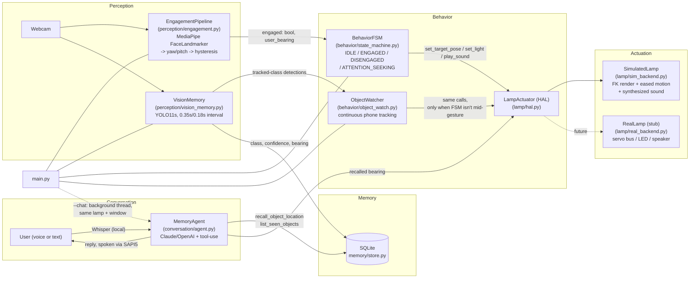
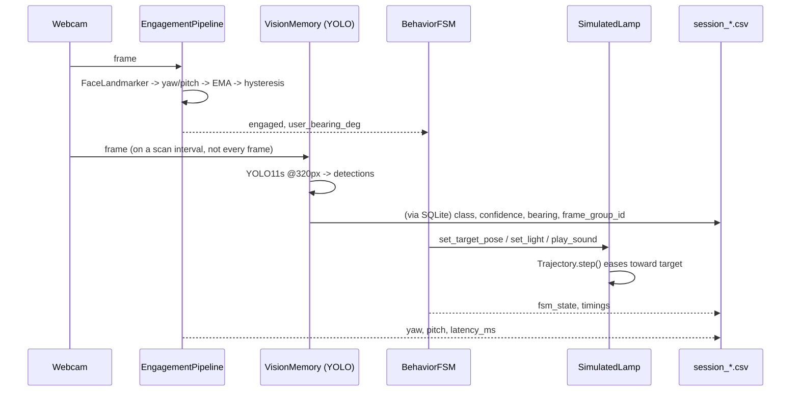
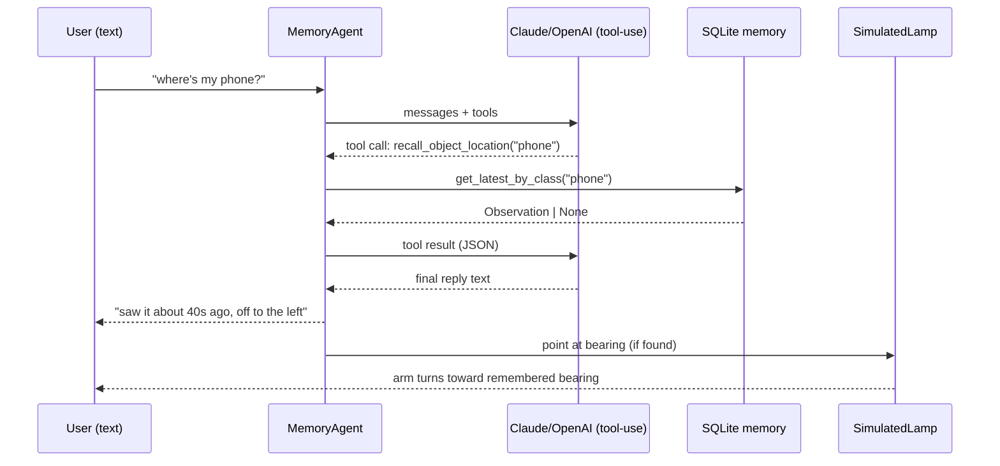

# LeLamp Challenge — Technical Writeup

A 6-DOF lamp that sees, reacts, remembers, and converses, built without
physical LeLamp hardware. Everything runs live against my laptop webcam;
the arm/light/speaker are simulated behind a hardware abstraction layer
so the same behavior code would drive real servos without changes.

## 1. Architecture



A few boundaries I drew on purpose:

- `perception/` only produces readings (an `EngagementReading`, a list of
  `Detection`s). It doesn't know a state machine or an LLM exists on the
  other end.
- `behavior/state_machine.py` only talks to the `LampActuator` interface,
  never to `SimulatedLamp` directly, and has zero camera/model code in it.
  That's what let me unit test it with a fake lamp
  (`tests/test_state_machine.py`) and what makes `RealLamp` a drop-in
  swap instead of a rewrite.
- `memory/store.py` is the one place that knows what the lamp has seen.
  Both the live loop (writer) and the chat agent (reader) touch it and
  nothing else.
- `conversation/agent.py` can't answer from thin air — its two tools are
  the only way it learns anything, so a hallucinated location would
  require the model to fabricate a tool result, which the loop doesn't
  let it do.

## 2. Data flow

**One frame, live loop (`main.py`):**



**Recall (`chat.py`, run via `main.py --chat` on a background thread):**



## 3. Decisions and why I made them

**Simulation instead of hardware.** I don't have a LeLamp unit. Instead
of faking a video or skipping actuation entirely, I built a
`LampActuator` interface with the calls a real driver would actually
need (`set_target_pose`, `set_light`, `play_sound`) and implemented it
against forward kinematics plus a small synthesized-sound backend
instead of a servo bus. Everything upstream only talks to that
interface. `lamp/real_backend.py` sketches what a Feetech-servo-bus
version would need — per-joint calibration, a trajectory thread writing
setpoints at the servo controller's own update rate, an LED bridge, a
real speaker — so the boundary is something I could actually build
against, not just a placeholder.

**Head pose over iris tracking for engagement.** `perception/engagement.py`
uses MediaPipe's facial transformation matrix (yaw/pitch) as the main
signal, with iris centering only as a secondary check for "head pointed
forward but eyes clearly looking elsewhere." Iris tracking falls apart
fast at webcam resolution once the head turns even a little off-axis,
and that's exactly the range a desk lamp spends most of its time
watching (wide horizontal angle, 30-80cm away). Making iris tracking
primary would trade reliability in the common case for a small gain on
an edge case. Head pose holds up across the whole range.

**Two-threshold hysteresis, not a single cutoff.** A single yaw/pitch
threshold flickers right at the boundary. `config.py` splits it into a
tight `ENGAGE_ENTER_*` cone to start engaging and a looser
`ENGAGE_EXIT_*` cone to leave it, each requiring several consecutive
frames before the state actually flips. The gap between enter and exit
is a deadband; the frame count eats single-frame noise on top of that.
Both are named constants specifically so they're easy to sweep:

| enter/exit gap | dwell frames | what happens |
|---|---|---|
| narrow (15/17°) | low (2-3) | responsive, visibly flickers near the edge |
| 15/25° (what I shipped) | 5/8 | ~0.15-0.25s reaction lag, stable |
| very wide (15/40°) | high (15+) | feels sluggish, almost never disengages |

**YOLO on an interval, not every frame — and capping torch's thread pool.**
This machine has no CUDA. Engagement detection needs to stay close to
30fps since it gates the whole interaction; scene memory doesn't —
objects on a desk don't move between one glance and the next.
`VisionMemory.maybe_scan()` runs on a wall-clock interval instead of
per-frame (`YOLO_SCAN_INTERVAL_S` = 0.35s normally, 0.18s while
`ObjectWatcher` is actively tracking something). Model is YOLO11s, not
the nano tier — meaningfully better hit rate (~47 vs ~39.5 mAP on COCO)
for not much latency cost in isolation.

Isolation turned out to be the catch: benchmarked alone, YOLO11s ran
~28ms/scan on this CPU, but inside the actual live loop it cost
70-90ms, with occasional spikes past 250ms. Torch was defaulting to 16
threads on this 22-core machine and fighting MediaPipe's own CPU
inference for the same cores. Capping torch to 4 threads
(`torch.set_num_threads(4)` in `vision_memory.py`) brought in-loop scan
cost down to ~45ms typical, ~80ms worst case, spikes gone. A number
measured in isolation doesn't tell you what it costs once it's sharing a
process with everything else — worth checking before picking a cadence
around it.

**Bearings from a fixed camera, not the lamp's own head.** `memory/store.py`
stores each object's bearing relative to the camera's own view, not
adjusted for the lamp's joint state at the time. The webcam sits next to
the lamp rather than on its moving head, so this is both simpler and
more accurate — compounding the lamp's pose estimate into every stored
bearing would just stack error for no reason with this setup. If the
camera were head-mounted, the fix is one line:
`stored_bearing = frame_bearing + lamp_yaw_at_capture_time`. Worth
noting for later, not worth building for a webcam that doesn't move.

Bearing also needs to be mirrored relative to the user, not just the raw
camera frame — I got this wrong on the first pass and only caught it by
actually using the thing. The camera faces the user, so "toward the
right edge of the raw image" is physically the user's *left*, same
reason a video-call self-view usually gets mirrored before you see it.
The first version reported the raw-frame side, so `chat.py` would say an
object was "off to the left" when it was sitting on my right. Both
`_face_bearing_deg` (`engagement.py`) and the object bearing calc
(`vision_memory.py`) now negate the frame position before turning it
into degrees, so what gets stored and spoken is the direction you'd
actually turn your head to check.

That fix was about the *math* — where the lamp actually turns to point.
It left a separate, purely cosmetic problem: the live webcam window
still displayed the raw, un-mirrored frame, which reads as "backwards"
for the same reason any un-mirrored front camera does. Fixing the math
didn't fix this, because the display was never wired to the bearing
calculation in the first place — two independent consumers of the same
raw frame. Rather than touch detection again, `viz.mirror_frame` /
`viz.mirror_detections` (`viz.py`) flip the frame and the YOLO boxes
*only* at the point where they're drawn for the window/recording — every
upstream computation still runs on the original frame, untouched.

**Window sizing, DPI scaling, and why bigger meant rendering bigger, not
stretching a smaller image.** `cv2.imshow()` on a window that's never
had `cv2.namedWindow()` called on it defaults to `WINDOW_AUTOSIZE`,
which locks the window to the composite's exact pixel size with no
scaling and no clamping to the screen — on the original 640x480 webcam
feed plus a lamp panel plus a side panel, that ran wider than this
laptop's screen and clipped the right edge. `Win32 GetSystemMetrics`
reported a usable desktop of 1280x800 at the time, which is itself
misleading: it's a *virtualized* figure Windows hands to any process
that hasn't declared itself DPI-aware, on a panel that's actually
3840x2400 at 300% display scaling. `viz.open_fitted_window()` creates
the window as `WINDOW_NORMAL` and fits it to the real screen size;
`viz.enable_dpi_awareness()` calls `SetProcessDpiAwareness` once, before
any window gets created in either `main.py` or `chat.py`, so
`GetSystemMetrics` reports the real resolution and Windows stops
bitmap-stretching the window's content on its own. Both matter together
— shrinking a window without DPI-awareness means the OS immediately
stretches that already-downscaled image back up, which is a visibly
softer result than either fix alone.

That distinction mattered again when I bumped the capture resolution
up: `config.FRAME_WIDTH/HEIGHT` went from 640x480 to 1920x1080 (probed
first — this webcam only does 16:9 steps up to 1920x1080, no 4:3 above
640x480) and `lamp/sim_backend.py`'s `CANVAS_SIZE` went from 420 to 1080
to match. The tempting shortcut for "make the window bigger" is
`cv2.resizeWindow()` to a larger target, which just scales a low-res
image up and looks exactly as soft as the DPI-blur problem, inverted.
The only way to get a genuinely sharper picture at a bigger size is more
real pixels to begin with, so the fix touched where pixels get produced,
not the window that displays them. Everything downstream needed the
same proportional bump or it renders correctly-sized images next to
comically tiny HUD text — `viz._UI_SCALE` (`1920/640 = 3.0`) scales
every font size, line thickness, and margin in `draw_webcam_hud`,
`draw_detections`, and `make_text_panel`, and `lamp/sim_backend.py` has
its own equivalent (`_SCALE = CANVAS_SIZE / 420`) for the arm rendering.
Latency moved measurably from this — full per-frame loop p50 went from
~30ms to ~51ms, since compositing now touches roughly 6x more pixels
per frame — while engagement and YOLO latency stayed flat, since both
resize internally to a fixed model input size regardless of the raw
frame's resolution. ~51ms p50 is still well inside real-time feel; a
disclosed tradeoff for a bigger, sharper window, not a hidden
regression.

**Two rows instead of three side-by-side panels.** The layout is webcam
and lamp sim side by side on top, with the FSM/memory/debug HUD as its
own full-width row below rather than a third narrow column squeezed in
next to the other two — a wide-but-short row full of single-column text
either runs off the bottom or leaves most of the width empty, so
`make_text_panel` supports multiple columns (`columns=3`) and an
independent scale (1.8, down from the webcam HUD's 3.0). The debug/
memory info is worth being legible, not worth being exactly as huge as
the camera feed. `main.py` computes the exact row-1 width before
building the info panel, so `compose_panels`'s width-matching resize is
normally a no-op rather than a stretch that would distort the text.

**Recall runs on a background thread, sharing one lamp.** `chat.py`
started life as a fully separate process, only sharing state with
`main.py` through the SQLite file — that sidestepped putting a
network-bound LLM call inside the same tight loop engagement detection
depends on for feeling responsive, at the cost of two independent
`SimulatedLamp` instances and windows. `main.py --chat` now spawns the
conversation loop (`chat.run`) as a background thread against the same
lamp and the same window instead: the LLM call still can't block the
render loop, since it's on its own thread, but now both drive one
physical lamp instead of two that only agreed via a database file. The
one new thing that needed handling: `ATTENTION_SEEKING` is a short,
timed animation that owns pose/light for its duration (same as it
already did for `ObjectWatcher`), so a voice command briefly waits it
out (`chat._wait_out_attention_seek`) instead of fighting it. A shared
`threading.Lock` in `SimulatedLamp` guards the actual state writes; a
`shutdown_event` lets `main.py` stop the thread cleanly on exit instead
of killing it mid-`sd.play()`/TTS call — the same class of bug that
segfaulted the sound worker (see below) if done abruptly.

**Anticipation + overshoot instead of linear interpolation.** `lamp/motion.py`
gives every move a brief wind-up opposite its direction of travel, then
an ease-out-back curve that overshoots the target slightly and settles.
Cheap to implement, and probably the single biggest thing that makes the
arm read as alive instead of a servo sweeping between two setpoints.
Duration, wind-up magnitude, and overshoot strength are each jittered by
a random amount per move rather than fixed, along with a two-frequency
idle "breathing" wobble instead of one — a move that plays back exactly
the same way every time, and an idle animation with an obvious loop
period, both read as mechanical fairly quickly once you're watching for
it.

**Attention-seeking gives up.** `BehaviorFSM` caps re-engagement attempts
at `ATTENTION_SEEK_MAX_ATTEMPTS` (3, with a cooldown between them), then
falls back to idle and stops. A lamp that keeps chirping at someone who's
ignoring it reads as needy, not aware. Giving up gracefully is part of
the behavior, not a missing feature.

**Watching an object is a separate module from the FSM, not a new state.**
`ObjectWatcher` (`behavior/object_watch.py`) is what makes the lamp track
your phone as you move it around and settle once it's actually gone. I
didn't fold this into `BehaviorFSM` as another state — it isn't really
mutually exclusive with IDLE/DISENGAGED the way ENGAGED and
ATTENTION_SEEKING are with each other, it's more like an interrupt that
can happen *during* either of those. So it's its own small class with
the same "only talks to LampActuator" rule, checked every tick. While
it's active (and for a few seconds after), `VisionMemory` also switches
to a faster scan interval (`YOLO_FAST_SCAN_INTERVAL_S`) so the
"following" actually looks responsive instead of choppy. I didn't build
a separate memory pathway for this — `VisionMemory` was already writing
every sighting to SQLite on its normal cadence, and `get_latest_by_class`
already returns the most recent one, so wherever the phone was last seen
becomes "where you put it" for free once it stops moving.

The first version fired as a discrete burst: detect movement past a
threshold, hold a fixed gesture for 1.4s, snap back to neutral. That
matched "the lamp glances when I set my phone down" but not "the lamp
keeps following it while I'm holding and looking at it" — and worse, at
a 0.6s scan interval, 1.4s of hold is only two or three scans deep. A
couple of missed detections in a row (which off-angle phone shots make
common) let the timer run out mid-gesture, so it visibly snapped back
and re-started from scratch on the next successful detection. From the
outside that reads as "it keeps stopping," which is what it was actually
doing.

I rewrote it around continuous tracking instead of discrete bursts:
`ObjectWatcher.update` re-aims at the object's current bearing on every
scan it's detected (throttled by `WATCH_REAIM_DEG` so bbox jitter on a
stationary object doesn't twitch the arm), and only settles back to
neutral once it's been genuinely missing for `WATCH_LOST_GRACE_S` (2s) —
long enough to ride out a run of bad-angle misses without ever visibly
dropping the gesture. The acquire flourish (anticipation, overshoot,
chirp) only plays on a fresh acquire, not on every re-aim, so ongoing
tracking reads as calm following rather than a repeated startle.

`should_scan_fast()` needed a second pass after the rewrite. My first
instinct was `self.active or self._lost_t < 3.0`, same shape as the old
code with the new state swapped in. But `_lost_t` resets to 0 on every
successful detection, so that condition is trivially true on *every*
tick the object is currently visible, not just briefly after losing it
— fast-scan effectively never turned off for a phone just sitting on the
desk in frame. That's a real, permanent CPU cost for something not
moving. Fixed by keying it on `_time_since_reaim` (resets only on an
actual re-aim) while the object is visible, and falling back to
`_lost_t` only when it genuinely isn't detected — the two conditions are
mutually exclusive by construction now.

Two other things made the "doesn't detect well off-angle" problem worse
than it needed to be. `YOLO_CONF_THRESHOLD` (0.45) is global — an
off-angle phone scoring 0.35 gets discarded before `ObjectWatcher` ever
sees it, and lowering the global threshold to fix that would also let
weaker detections across all 80 COCO classes into scene memory. Fixed by
giving tracked classes their own, lower `TRACKED_CLASS_CONF_THRESHOLD`
(0.30) in `vision_memory.py`, applied per-detection rather than
globally — a phone is large and visually distinctive enough that a lower
bar specifically for it is low-risk in a way it wouldn't be for the
whole class list. The scan interval itself was also more conservative
than the machine can actually support — measured in-loop scan cost
(YOLO11s, 320px, torch capped to 4 threads) is p50 ~76ms / p95 ~108ms
even under a throttled CPU state, leaving headroom under a shorter
interval. Tightened to 0.35s normal / 0.18s while actively watching.

**"A person in front of the lamp always outranks an object on the desk"
was too broad a rule.** That was the original justification for
blocking `ObjectWatcher` entirely during ENGAGED, and it sounds
reasonable in the abstract. In practice it meant phone-tracking
essentially never fired during normal use, since testing the feature
requires being in frame yourself, facing the camera — exactly what
triggers ENGAGED. Reading `BehaviorFSM` closely: ENGAGED only calls
`set_target_pose` *once*, on the transition in (`_enter_engaged`) — it
never re-asserts the pose on later ticks the way `ObjectWatcher` does
continuously. ATTENTION_SEEKING is different, driving a short, precisely
timed animation every tick while active. So there isn't actually a fight
for control during ENGAGED — the FSM sets a pose once and does nothing
further until the next transition, leaving `ObjectWatcher` free to
track. ATTENTION_SEEKING still needs the hard block, since letting
`ObjectWatcher` grab the pose mid-animation would visibly break a
deliberate gesture.

Loosening the block from `(ENGAGED, ATTENTION_SEEKING)` down to just
`ATTENTION_SEEKING` surfaced a second, related bug: if the phone gets
lost while still ENGAGED, the old lost-tracking settle-back
(`_stop_watch()`) reset the lamp to neutral pose/idle light — correct
when nobody's there, wrong here, since the FSM never re-applies its own
"looking at you" pose to correct it. The lamp would visibly look away
from someone still sitting right there. Fixed with
`ObjectWatcher._return_to_engaged_look()`, which mirrors
`BehaviorFSM._enter_engaged`'s own pose/light so losing the phone
mid-engagement reads as "still looking at you," not "resetting."
Covered by `test_tracks_the_object_while_engaged` and
`test_returns_to_engaged_look_when_lost_while_still_engaged` in
`tests/test_object_watch.py`.

**A power-plan surprise while benchmarking.** Re-measuring scan latency
to pick new intervals, I got p50=147ms at 320px — 5x the ~28ms this doc
had documented earlier for the same model and image size. Checking CPU
state directly (`Win32_Processor` clock speed, `% Processor Performance`,
`Win32_Battery`) explained it: on battery at 29% charge under Windows'
Balanced power plan, this machine was running at roughly half its
available turbo headroom. The new scan intervals ended up tuned against
the worse of the two states on purpose — safe on battery, more headroom
on AC. Worth ruling out on any latency complaint before chasing further
tuning: the CPU's own power state can be a bigger factor than anything
in the code.

**Voice I/O runs locally, independent of the LLM provider.** `chat.py --voice`
records from the mic and transcribes with a local Whisper model
(`conversation/voice.py`) rather than sending audio to a cloud STT
endpoint — voice mode works regardless of which of the two LLM keys is
funded at any given moment, and the whole voice loop doesn't add a
second network dependency on top of the one the LLM call already needs.
Whisper gets the recorded audio as an in-memory array instead of a file
path, which sidesteps needing ffmpeg installed. The model loads once at
startup rather than per question — a multi-second wait before every
reply would make the "talk to it" loop feel broken even though each
individual transcription only takes a fraction of a second once it's
warm.

**Voice is wake-word gated, not a fixed listen window.** The first
version recorded a blind 5-second block every turn, which either cut off
a longer answer or left dead air after a short one, with no way to
signal "I'm not talking to it right now" other than staying silent for
the whole window. `wait_for_wake_word` polls the mic in short chunks,
running each one through Whisper only if its RMS shows it wasn't just
silence, and returns once the wake word shows up in a transcript — no
new dependency, just the same local Whisper model reused as a keyword
spotter. `record_until_silence` streams from the mic and stops once
you've gone quiet for `VOICE_SILENCE_TIMEOUT_S`, with `VOICE_MAX_RECORD_S`
as a hard cap so a stuck-open mic can't record forever.

A few rounds of live testing turned up real bugs in this path, roughly
in the order I found them:

- **No way out.** The quit check only looked at the question asked
  *after* waking it up, so leaving voice mode meant successfully waking
  it first, every time — a dead end short of Ctrl-C. Fixed by having
  `wait_for_wake_word` itself also recognize "quit"/"exit" in the same
  passive polling it does for the wake phrase.
- **A silent false-positive wake stalled for the full recording cap.**
  If the wake word fires on background noise, or nothing gets said after
  the chirp, the silence timer never starts (it only starts counting
  *after* real speech), so it ran all the way to `VOICE_MAX_RECORD_S` — a
  dead stall for no reason. Fixed with a separate, shorter
  `VOICE_NO_SPEECH_TIMEOUT_S` that bails out if nothing was said at all.
- **Wake matching was too literal, and RMS was measured wrong.**
  Requiring the exact substring "hey lamp" meant Whisper dropping or
  mangling the filler word "hey" silently killed a correct attempt —
  matching on just "lamp" (the distinctive last word) fixed most of it.
  What was left turned out to be a miscalibrated volume gate:
  `VOICE_GATE_RMS_THRESHOLD` was reusing the same 0.02 threshold as the
  interruption-awareness feature, but real speech into this laptop's
  mic peaked around 0.010-0.016 and never crossed it — every attempt was
  silently discarded before Whisper ever ran. Split into its own
  threshold (0.008) once I had per-chunk RMS logging in place to
  actually see the numbers, rather than guessing at a fix blind. Later,
  a further round of testing showed even the 0.008 average-RMS gate was
  inconsistent for real conversational speech — a short spoken word
  averaged against a mostly-silent chunk still read as too quiet.
  Switched to peak RMS over short subframes instead of one average over
  the whole chunk (`voice._peak_rms`), which reads the loud part of the
  utterance instead of diluting it against the pauses around it.

**Interruption awareness is energy-based, not speech recognition.**
`perception/audio_monitor.py` runs a background mic stream and flags
"busy" whenever RMS stays above the ambient floor for a moment, that's
it. `BehaviorFSM._tick_disengaged` checks this before *starting* a new
attention-seek attempt. The bonus item asks for "knows not to interrupt
when the user is talking or watching TV," and both of those are just
"there's sustained audio happening nearby" from a single-mic lamp's
point of view — it can't cheaply tell talking apart from a TV, and for
the purpose of "should I chirp for attention right now," it doesn't need
to.

**Multi-user speaker ID is visual, not audio diarization.** Real speaker
diarization needs per-person voiceprints — an earlier version of this
project actually tried that (resemblyzer voice embeddings), but with one
mic and no array to localize sound direction from, it couldn't reliably
tell who was talking from audio alone. `perception/multi_face.py` runs
FaceLandmarker with `num_faces=4` and, while the mic is recording a
question, samples video over the same window and tracks each face's
mouth-openness. The face with the most mouth-movement variance over that
window is the one talking. It's a coarse signal — someone chewing gum
would confuse it — but it's cheap, genuinely visual, and right far more
often than picking a face at random. It's on by default (`--no-multi-user`
to skip it); `SpeakerDetector` takes an injectable frame source so it
shares `vision_memory`'s already-open camera handle instead of opening a
second one — a second concurrent handle on the same device is what many
webcam drivers silently refuse, which is what "opt-in, degrades to no
speaker ID" used to paper over.

**A tool schema stopping hallucination isn't the same as a prompt
stopping it.** An early system prompt said "if you haven't seen
something, say so, and offer what you have seen instead of refusing" —
reasonable-sounding, and it backfired: asked about a phone that was
never actually seen (only a person was in memory), the model reported
"just saw it, near a person, maybe you had it in hand," presenting a
guess as a direct sighting. The tool architecture prevents inventing a
location out of nothing, but it doesn't stop the model from creatively
misreading a `found: false` result once instructed to "offer what you
have seen." The miss-handling instruction had to get much more literal:
state the miss plainly, as its own sentence, before anything else, and
never use a different object's sighting as evidence for the one that
wasn't found. A tool boundary constrains what data the model can act on,
not how it's allowed to talk about the gaps.

**A few real bugs the self-learning tests turned up.** Writing a
multi-round test for `AdaptationEngine` — engage, disengage,
attention-seek, re-engage, repeat — surfaced a bug in the core FSM, not
the bonus code: after the first attention-seek attempt, the FSM never
tried again, getting stuck in `DISENGAGED` on every round after the
first. `BehaviorFSM._tick_disengaged` guards on `self._attention_phase
!= 0` so it won't start a second gesture while one's still playing, but
`_attention_phase` only ever resets back to 0 from inside
`_tick_attention_seek`, which only runs while attention-seeking is
active. Re-engage fast enough to interrupt the gesture itself — the
realistic case, someone glancing at the lamp the moment it starts to
move — and the phase never gets the chance to reset, sticking at a
nonzero value forever. Fixed by resetting `_attention_phase` (and its
timer) in `_enter_engaged`, since re-engaging should always cancel an
in-progress gesture cleanly. Regression test:
`test_quick_reengagement_mid_gesture_does_not_kill_future_attention_seeking`.

Same root pattern showed up again in `ObjectWatcher._stop_watch()`,
which unconditionally reset the lamp to neutral pose/idle light when its
hold timer expired, with no check for whether the FSM had taken the lamp
back over in the meantime. Put your phone down, the watch gesture
starts, then a person shows up before the hold finishes: the FSM claims
the lamp, and a moment later the watcher's timer fires and quietly
resets it underneath the FSM, which never notices because it only
re-actuates on its own transitions. Fixed by having `ObjectWatcher.update`
check the current FSM state before settling back. Both bugs are the same
shape: two actors can drive the same lamp, and only one of them
re-actuates on transitions while the other fires on a plain timer — the
timer-driven side always needs to check who's holding the lamp before it
acts, not just before it starts.

A third bug, different shape: the old `_last_bearing[cls]` tracking
(from the discrete-burst model, since replaced) got set the moment an
object was spotted and never cleared. Put the phone down, pick it up and
walk off, come back later and put it down near the same spot — the
"has it moved" check compared against the stale bearing, read "hasn't
moved," and silently did nothing. That's the single most common real
usage of the feature. Fixed at the time by clearing the stale bearing
after a timeout; the underlying lesson (state set once and never
cleared silently goes stale) carried forward into the continuous-
tracking rewrite's own lost-tracking timeout.

## 4. Evaluation

- `python -m eval.engagement_eval` — precision/recall/F1/accuracy plus a
  flicker-rate metric, from a `main.py --label` session (SPACE toggles
  ground truth live). It also reports a windowed version that drops
  frames within 500ms of a label change, since human reaction time plus
  the intentional dwell latency in the hysteresis means those frames are
  correctly out of sync, not wrongly — scoring them as errors would just
  punish the hysteresis on purpose.
- `python -m eval.latency_eval` — p50/p95/p99/max for the engagement
  stage, the YOLO scan stage, and the full per-frame loop, from the same
  session CSV.

**Engagement reliability**, from a real labeled `main.py --label` session
(session_20260804_134637.csv, 1224 frames over 70.1s, ~17.5fps effective,
a deliberate mixed pattern of quick glances and longer stretches, 41% of
frames labeled "looking"):

```
Engagement detection reliability -- session_20260804_134637.csv (1224 frames)
  raw (includes reaction-time/dwell mismatch near transitions) (n=1224):
    confusion matrix: TP=427 FP=75 FN=72 TN=650
    precision: 0.851  recall: 0.856  f1: 0.853  accuracy: 0.880
  windowed (excludes frames within 500ms of a label change) (n=1002):
    confusion matrix: TP=377 FP=27 FN=11 TN=587
    precision: 0.933  recall: 0.972  f1: 0.952  accuracy: 0.962
  flicker: 11.1 predicted-state changes/min
```

The gap between raw and windowed (0.853 -> 0.952 F1) is mostly the
hysteresis working as designed, not noise: excluding the 500ms around
each real transition removes exactly the frames where the dwell-frame
requirement is *supposed* to lag the label by a beat, and F1 climbs
because those weren't real errors to begin with. 11.1 predicted-state
changes/min over a 70s session with frequent deliberate glances is a
handful of real transitions, not boundary flicker — a flat, unchanging
gaze would read near 0.

**Latency**, from the same session:

```
Latency -- session_20260804_134637.csv (1224 frames)
  engagement (frame -> yaw/pitch): n=1224  p50=13.8ms  p95=17.1ms  p99=19.2ms  max=23.9ms
  memory scan (YOLO, when it runs): n=63  p50=44.3ms  p95=55.9ms  p99=61.4ms  max=64.2ms
  full per-frame loop: n=1224  p50=44.4ms  p95=84.4ms  p99=132.1ms  max=153.6ms
```

Faster than the earlier battery-throttled dev run documented in prior
revisions of this doc (engagement p50 15.4ms -> 13.8ms), though the full
loop's own p50 went up (29.8ms -> 44.4ms), most likely the 1920x1080
compositing cost this doc's own tradeoffs section already discloses,
now actually measured rather than assumed. These two runs aren't a clean
apples-to-apples comparison either way -- resolution changed between
them, not just power state -- consistent with the standing guidance
above to rule out both before chasing latency further.

## 5. Bonus items, and what's still not built

Built all four: interruption awareness (`perception/audio_monitor.py`),
multi-user speaker ID (`perception/multi_face.py`), emotion-from-voice
(`conversation/emotion.py`), and a bounded form of self-learning
(`behavior/adaptation.py`) — each covered in its own section above with
the honest scope of what it actually does versus a "real" version.

None of them are the full-strength version of what they're named after,
and that's deliberate rather than a shortcut I'm hiding: real speaker
diarization needs voiceprints, real emotion recognition needs a trained
model on labeled prosody data (or a multimodal model call, which adds
per-question latency and cost), and real self-learning needs a defined
reward signal, not just "adjust a threshold based on what happened."
Each section documents exactly where the line is and why I drew it
there.

## 6. Performance and reliability passes

A few rounds of running this against a real mic, real Bluetooth
peripherals, and a real (much bigger) window turned up problems that
don't show up in unit tests, worth documenting since they shaped a fair
amount of the code:

**Compositing cost at the bigger resolution.** At 1920x1080, per-frame
HUD compositing (mirror, overlays, lamp render, debug panel) ended up
costing more than YOLO's amortized share — direct stage timing showed
~50ms p50 in compositing alone; `imshow` itself was cheap (~6ms), so
that wasn't it. Fixed by dropping a redundant full-frame copy in
`draw_detections`, skipping a no-op `cv2.resize` when panels already
match target height, and redrawing the debug text panel every 4th frame
instead of every frame — nobody reads debug text at 30fps. p95 loop
latency dropped roughly 30%.

**Sound cues going silent on Bluetooth, then a segfault.** Testing the
synthesized chirps on Bluetooth earbuds surfaced two separate real bugs.
First, a multi-chirp event calling `sd.play()` once per chirp went
completely silent on that output, while one isolated `sd.play()` call
worked fine. Merging each event into a single buffer (one `sd.play()`
call) plus a silent lead-in didn't fix it either — what actually came
through audible was only a single continuous sweep with *zero* internal
silence, and even that was faint. **Audibility is confirmed on this
machine's built-in speakers, not reliably on Bluetooth output** —
worth flagging for anyone trying this on their own Bluetooth setup.
Second, unrelated bug: switching output devices mid-session and then
exiting the process segfaulted. `_SoundWorker` is a daemon thread
blocked on `queue.get()` forever, and getting killed mid-`sd.play()` at
interpreter shutdown crashed the process — device-independent,
reproduced on both Bluetooth and the built-in speakers. Fixed with an
explicit `stop()` (sentinel + join) called from `SimulatedLamp.close()`.

**Emotion detection was dead code in practice.** `_LOUD_RMS` in
`conversation/emotion.py` was 0.02, checked against a flat
whole-utterance RMS average — the same starting mistake as the original
voice-gate bug. Since "energetic" and "tense" both require crossing that
threshold, every utterance fell through to "quiet"/"calm" regardless of
actual tone. Fixed the same way as the wake-word gate: switched to peak
RMS and lowered the threshold to match what real speech on this mic
actually produces.

**Conversation follow-up window.** `chat.py` used to require the wake
word on every single turn. It now stays in a listening state after a
successful exchange for up to a minute before dropping back to
wake-word-gated idle, with the lamp holding an alert pose/color for the
whole window instead of relaxing to idle between turns.

**Motion and sound needed some randomness to read as alive.** The
easing curves in `lamp/motion.py` and the sweep-tone synthesis in
`lamp/sim_backend.py` originally produced the exact same motion or sound
every time a given event fired — same duration, same overshoot, same
pitch curve. That reads as mechanical fast, the same way a metronome
reads as artificial even at a musical tempo. Both now jitter their
parameters by a modest random amount per play (duration, wind-up and
overshoot strength for motion; pitch, vibrato, and volume for sound),
and the idle "breathing" animation sums two slightly different,
per-instance-randomized frequencies instead of one, so it drifts instead
of visibly looping.

**Whisper accuracy and TTS pacing.** Bumped the transcription model from
`base.en` to `small.en` for accuracy, at the cost of a bigger download
and somewhat higher per-turn latency. Slowed SAPI5's TTS rate from its
default ~200wpm to 175 — the faster default read as rushed.
